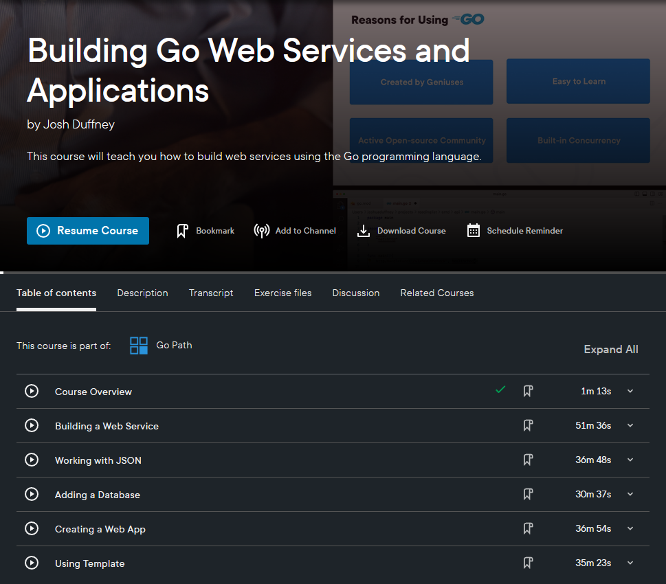

# Building Web Services and Applications with Go

This GitHub repository is dedicated to promoting the Pluralsight course titled "[Building Web Services and Applications with Go](https://www.pluralsight.com/courses/go-building-web-services-applications)". 

*In this course, you'll learn how to build scalable and maintainable web applications using the Go programming language.*

## Course Description

This course is designed for developers, SRE, and DevOps engineers who are interested in building web services and applications with Go. 

Throughout this course, you'll learn how to create a RESTful API using the standard library net/http package, how to work with databases and authentication. As well as, how to create a web application using the Go template package html/template.

Topics covered in this course include:

- [Building a Web Service](https://github.com/Duffney/go-building-web-services-applications/tree/02-build-a-web-service)
- [Working with JSON](https://github.com/Duffney/go-building-web-services-applications/tree/03-working-with-json)
- [Adding a Database](https://github.com/Duffney/go-building-web-services-applications/tree/04-adding-a-database)
- [Creating a Web App](https://github.com/Duffney/go-building-web-services-applications/tree/05-creating-a-web-app)
- [Using Templates](https://github.com/Duffney/go-building-web-services-applications/tree/06-using-templates)

By the end of this course, you'll have the knowledge and skills necessary to build and deploy your own web applications using Go.

> Each module of this course has a corresponding branch in this repository. You can use the branch dropdown above to switch between branches and follow along with the course.

## Repository Contents

This repository contains the following:

- Code examples used in the course
- Branches for each module in the course
- Commit history that matches the course modules

> You can browse the source code here and watch the course on [Pluralsight](https://www.pluralsight.com/courses/go-building-web-services-applications). 👈

## Additional Resources

- [Let's Go by Alex Edwards](https://lets-go.alexedwards.net/)
- [Let's Go Further by Alex Edwards](https://lets-go-further.alexedwards.net/)
- [Web Development w/ Google’s Go (golang) Programming Language with Todd McLeod](https://www.udemy.com/share/1022eC3@HGNszijh2H7xE0osoWjlLfBHvCRaWz-RUaD26EHDi2kfM7xhBweXJyhp8fBEb_GO/)
